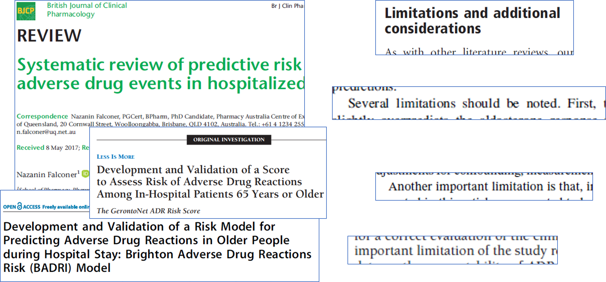

```{r meta, echo=FALSE, warning=FALSE}
library(metathis)
meta() %>%
  meta_general(
    description = "Test",
    generator = "xaringan and remark.js"
  ) %>% 
  meta_name("github-repo" = "andreasmeid") %>% 
  meta_social(
    title = "Test Titel",
    #url = "https://spcanelon.github.io/xaringan-basics-and-beyond/slides/day-01-basics.html#1",
    #image = "https://raw.githubusercontent.com/spcanelon/xaringan-basics-and-beyond/main/slides/day-01-cover-image.png",
    og_type = "website",
    og_author = "Andreas Meid"
  )
```

```{r setup, include=FALSE}
options(htmltools.dir.version = FALSE)

#library(devtools)
    #install_local('I:/Bereich/Neuausrichtung/GAM/icons-master')
    #install_local('I:/Bereich/Neuausrichtung/GAM/xaringanExtra-master')


library(icons)
library(xaringanExtra)
library(knitr)
library(kableExtra)
library(flextable)
library(magrittr)
library(dplyr)
library(tidyverse)
library(ggplot2); library(cowplot); library(gridExtra)
library(patchwork)
library(here)
library(emmeans)
library(gganimate)
library(viridis)
#library(nlmixr); require(yaml); library(xgxr); require(ggPMX); require(assertthat); require(GGally); require(maditr)
library(highcharter)
library(ggpmisc)

library(MASS)
library(data.table)
library(pROC)

set.seed(1) #for reproducibility
knitr::opts_chunk$set(
  fig.width=9, 
  fig.height=3.5, 
  fig.retina=3,
  #out.width = "50%",
  cache = FALSE,
  echo = TRUE,
  message = FALSE, 
  warning = FALSE,
  fig.show = TRUE,
  fig.showtext = TRUE,
  hiline = TRUE
)

xaringanExtra::use_panelset()
xaringanExtra::use_tile_view()
xaringanExtra::use_share_again()
xaringanExtra::style_share_again(
  share_buttons = c("twitter","linkedin")
)
xaringanExtra::use_fit_screen() #This extension adds a short cut key — Alt/Option+ F — that fits the slides to the screen and ignores the slide ratio

#use_logo() adds a logo to all of your slides. You can make the logo a clickable link and choose where on the slide it is placed. 
# To add a logo to your xaringan presentation, add the following code chunk to your slides’ R Markdown file.

#```{r xaringan-logo, echo=FALSE}
#xaringanExtra::use_logo(
#  image_url = "https://raw.githubusercontent.com/rstudio/hex-stickers/master/PNG/xaringan.png"
#)
#```

options(scipen=9999999)

```

class: title-slide, right, top
background-image: url(img/ukhd_en.png)
background-position: 10% 75%, 75% 75%
background-size: 20%, cover

.right-column[
# `r rmarkdown::metadata$title`
### `r rmarkdown::metadata$subtitle`

**`r rmarkdown::metadata$author`**<br>
<br>
`r rmarkdown::metadata$institute` <br><br>
`r rmarkdown::metadata$date`
]

---
# Status quo in ADE prediction
<!-- What are the challenges -->



---
# Two common admission stats

```{r admission_data, echo=F, eval=T,  results='hide',message=F, warning=F}

library(readxl)

stats <- read_excel("diagnosedaten.xlsx", sheet = "Geschlecht_Anzahl_21", range="A3:C14359",
                    col_names=T) %>% slice(3:14356) %>%
  dplyr::rename(ICD=`ICD-10-4`)

hypoglycemia_stats <- stats %>% filter(grepl('E160|E161|E162', ICD)) #filter(ICD %in% c("C857", "C859"))
fall_stats <-  stats %>% filter(grepl('Z9181|R296|S01|S02|S09|S22|S32|S52|S62|S82|S92', ICD))

hypoglycemia_stats <- hypoglycemia_stats %>% pivot_wider(names_from = Geschlecht,values_from = c(Insgesamt)) %>%
  mutate(Admissions=as.numeric(m)+as.numeric(w)) %>% dplyr::select(ICD, Admissions) %>% mutate(Outcome = "Hypoglycemia") %>% mutate(ICD = case_when(ICD == "E160" ~ "Drug-induced\nhypoglycaemia",
                                                                                                                                                    ICD == "E161" ~ "Other\nhypoglycaemia",
                                                                                                                                                    ICD == "E162" ~ "Unspecified\nhypoglycaemia")) %>%
    dplyr::rename(`ICD code/set`=ICD)

fall_stats <- fall_stats %>% pivot_wider(names_from = Geschlecht,values_from = c(Insgesamt)) %>%
  mutate(Admissions=as.numeric(m)+as.numeric(w)) %>% dplyr::select(ICD, Admissions) %>%
  summarise(Admissions=sum(Admissions)) %>% mutate(Outcome = "Falls", `ICD code/set`="Fall-related fractures")

hypoglycemia_plot <- hypoglycemia_stats %>% #rbind(., fall_stats) %>% 
  ggplot(., aes(x=`ICD code/set`, y=Admissions)) +
  geom_bar(stat="identity") + facet_grid(.~Outcome) +
  scale_y_continuous("Admissions", expand=c(0,0), limits = c(1, 500000),
                     breaks=c(100, 500, 1000, 10000, 100000, 500000), trans="log10") +
  scale_x_discrete("ICD code/set") +  # flip coordinates (puts labels on y axis)
    theme_minimal() + #theme_bw() + # use a white background
    theme(legend.position = "none",
        axis.line = element_line(size = 1, colour = "black", linetype = "solid"),
        axis.ticks.x = element_line(size = 0.8),
        axis.ticks.y = element_line(size = 0.8),
        axis.ticks.length = unit(.1, "cm"),
        axis.text.x = element_text(colour="black", size=28,angle=0, vjust=0, hjust=0.5),
        axis.text.y = element_text(colour="black", size=32),
        axis.title.y =  element_text(colour="black", size=34, face="bold"),#
        axis.title.x =  element_text(colour="black", size=34, face="bold"),#
        strip.text= element_text(colour="black", size=30),
        plot.title = element_text(hjust = 0.25, size=34),
        panel.spacing = unit(0.2, "lines"),
        plot.margin = unit(c(5,10,5,5), "pt"), #t,r,b,l
        strip.background = element_blank(),
        strip.placement = "outside")

fall_plot <- fall_stats %>% #rbind(., fall_stats) %>% 
  ggplot(., aes(x=`ICD code/set`, y=Admissions)) +
  geom_bar(stat="identity") + facet_grid(.~Outcome) +
  scale_y_continuous("Admissions", expand=c(0,0), limits = c(1, 500000),
                     breaks=c(100, 500, 1000, 10000, 100000, 500000), trans="log10") +
  scale_x_discrete("ICD code/set") +  # flip coordinates (puts labels on y axis)
    theme_minimal() + #theme_bw() + # use a white background
    theme(legend.position = "none",
        axis.line = element_line(size = 1, colour = "black", linetype = "solid"),
        axis.ticks.x = element_line(size = 0.8),
        axis.ticks.y = element_line(size = 0.8),
        axis.ticks.length = unit(.1, "cm"),
        axis.text.x = element_text(colour="black", size=28,angle=0, vjust=0, hjust=0.5),
        axis.text.y = element_text(colour="black", size=32),
        axis.title.y =  element_text(colour="black", size=34, face="bold"),#
        axis.title.x =  element_text(colour="black", size=34, face="bold"),#
        strip.text= element_text(colour="black", size=30),
        plot.title = element_text(hjust = 0.25, size=34),
        panel.spacing = unit(0.2, "lines"),
        plot.margin = unit(c(5,10,5,5), "pt"), #t,r,b,l
        strip.background = element_blank(),
        strip.placement = "outside")

#, Other hypoglycaemia, Hypoglycaemia, unspecified
```

Admissions for hypoglycemia and falls in Germany 2021 [destatis]:
--
.pull-left[


```{r hypo_plot, eval=T, fig.width = 15, fig.height= 13.5, echo=FALSE,  message=F, warning=F}
hypoglycemia_plot
```

]
--
.pull-right[
```{r fall_plot, eval=T, fig.width = 15, fig.height= 13.5, echo=FALSE,  message=F, warning=F}
fall_plot
```
]


---
exclude: true

# Let's start with a use-case: hypoglycemia prediction

> **Hypoglycemia** is the major limiting factor in optimal glycemic management for patients with diabetes

> Hypoglycemia occurs in 20-60% of patients with diabetes mellitus [1], with one in four diabetes-related **hospitalizations due to hypoglycemia** [2]

> The *American Diabetes Association* (ADA) reported in 2013 that greater attention must be focused on understanding which patients were at most **risk for hypoglycemia** [3]. $\rightarrow$ balance reduction in hyperglycemia with hypoglycemia risk [4,5]

<!-- association of hypoglycemia with increased risk of vascular events and all-cause mortality -->


---
exclude: true

# Hypoglycemia prediction with inpatient data


.panelset[
.panel[.panel-name[Overview]

> Inclusion of routine biochemical **data**, available at the time of admission, can add prognostic value [6] 

> Examples were more complex (machine-learning) **models** did [7] or did not improve prediction [8]

> successfully applied to **risks** during hospitalization and for potentially following admissions [9]

]

.panel[.panel-name[Input variables [10] ]


.footnote[_Zhang L et al. Front Public Health 2023;11:1044059._]
]

.panel[.panel-name[Modelling techniques [10] ]


]
]

---
exclude: true

# Obstacles for hypoglycemia prediction from outpatient data

> Potential **risk factors** are known (also from the outpatient setting [11], e.g., 
  + social status, 
  + comorbidities, 
  + age, 
  + prior hypoglycemia
  
> ), but no prediction model exists to guide interventions to lower hypoglycemia risk in predisposed patients (and other long-term consequences!)
  
> which is maybe also due to **limitations in respective data sources** (e.g., not all outcomes accurately and completely captured [12])

---
# More common situation:

> Focus on large **target population**, e.g., older adults with polypharmacy, which is, however, very heterogeneous [13]

> "*Simple tools based on few* **medicine classes** *may not be effective in identifying high risk patients.*" [14] 

> Often considers risks of potentially inappropriate prescribing (e.g., OPERAM [15]) on a (core) **outcome set** of ADRs

> Efforts to automate **outcome definition** and increase its accuracy [16], because causality assessment is tedious and specific ADE-codes are hardly used [17]


## Given the many efforts w/o groundbreaking success, what are typical challenges?

---
class: body-yellow
background-image: url(img/DrugSymposium_Background.PNG)

## What if ...

> ... we knew the truly true predictor-outcome relationships,

> how would the numerous obstacles and challenges <br /> in practice then worsen our predictive performance

--

## Let's take <br /> a journey <br />from the <br /> different <br />direction
 

<!-- 
class: body-yellow
background-image: url(img/DrugSymposium_Background.PNG)
-->


```{r simulation, echo=F, eval=T,  results='hide',message=F, warning=F}
# set seed
  saat <- 1234
  set.seed(saat)

  n      <- 1500
  numsim <- 1#100
  
  sim_new <- T
  
  source("data/sim_parameters.R")
  source("data/sim_functions.R")

  
  if (sim_new) {
    nsituations=8
    set.seed(saat)
    df_sim_matrix <- data.frame(outcome_freq=logical(), predictor_strength=logical(), medication_association=logical(), predictor_freq=logical(), treatment_freq=logical(), situation=numeric())
    for (i in 1:nsituations) {
      
      df_sim_matrix[i,] <- data.frame(outcome_freq=sample(c(T,F), size=1, prob=c(0.5, 0.5)), 
                                      predictor_strength=sample(c(T,F), size=1, prob=c(0.5, 0.5)), 
                                      medication_association=sample(c(T,F), size=1, prob=c(0.5, 0.5)), 
                                      predictor_freq=sample(c(T,F), size=1, prob=c(0.5, 0.5)),
                                      treatment_freq=sample(c(T,F), size=1, prob=c(0.5, 0.5)), situation=i)
    }
  } else {
    load("data/df_sim_matrix.RData")
  }
  
  if (sim_new) {
    
sim_df <- data.frame(ID=numeric(), trt=numeric(), age=numeric(), sex=numeric(), drugs=numeric(), 
                     prior_hos=numeric(), score1=numeric(), score2=numeric(), comed1=numeric(), 
                     comed2=numeric(), comed3=numeric(), Y.1=numeric(), Y.2=numeric(), Y.3=numeric(), 
                     Y.4=numeric(), Y.5=numeric(), Y.6=numeric(), Y.7=numeric(), Y.8=numeric(),
                     situation=numeric())
for (j in 1:nsituations) {
  
  set.seed(saat)
  population.temp <- do.call(cbind, lapply(rep(n, numsim), sim_data, 
                                   alpha=alpha, 
                                   trt_freq=df_sim_matrix$treatment_freq[j],
                                   pred_freq=df_sim_matrix$predictor_freq[j])) %>%
    mutate(pop_situation=j, ID=1:n)
  
  outcomes <- data.frame(Y=numeric(), out_situation=numeric())
  
  for (i in 1:nsituations) {
    
    predictability <- ifelse(df_sim_matrix$outcome_freq[i], -3.5, -5) # add new intercept
    predictors <- beta[-1]                                            # remove old intercept
    predictors[1] <- ifelse(df_sim_matrix$medication_association[i], predictors[1],
                            predictors[1]/2)                       # treatment
    predictors[2:length(predictors)] <- ifelse(df_sim_matrix$predictor_strength[i], predictors[2:length(predictors)],
                                               predictors[2:length(predictors)]/2) # other variables
    
    ds.temp <- sim_out(sim_dat=population.temp,
                       beta=c(c(constant=predictability), predictors)) %>%
      mutate(out_situation=i, ID=1:n) %>%  dplyr::select(ID, Y, out_situation)
    outcomes <- rbind(outcomes, ds.temp)
    
  }
  outcomes_wide <- reshape(outcomes, idvar = "ID", timevar = "out_situation", direction = "wide")
  
  ds.temp <- population.temp %>% left_join(., outcomes_wide, by="ID") %>%
    mutate(ID = ID + 1500 * (j-1)) %>%
    dplyr::select(ID, trt, age, sex, drugs, prior_hosp, score1, score2, comed1, comed2, comed3, 
           Y.1, Y.2, Y.3, Y.4, Y.5, Y.6, Y.7, Y.8, pop_situation) %>% rename(situation=pop_situation)

  sim_df <- rbind(sim_df, ds.temp)
} 
  } else {
  load("data/sim_df.RData")
  } 
  
```

---
class: large <!--my-one-page-font-->

# 7 major obstacles to overcome in practice

1. ADR often defined as a mixture of separate outcomes

2. Imperfectly classified outcome

3. Predictor uncertainty (e.g., unmeasured variables, time-dependent changes)

4. Heterogeneous populations (for development and validation)

5. Small samples (e.g., for validation)

6. Arbitrary choice of modeling technique

7. Incomplete, inconsistent, and intransparent reporting


---
class: body-yellow
background-image: url(img/DrugSymposium_Background.PNG)

## Challenge 1:  <br /> Heterogeneous data with <br /> different outcomes 

in

> mixed (sub-) populations: <br />different frequencies of drug <br />and other risk factors

with varying

> "predictability": outcome frequency, <br />drug-outcome association, <br />remaining predictor strength


---

# Simulation framework


.panelset[
.panel[.panel-name[Setting [18]]

<!-- 
> Setting .footnote[_Meid AD et al. Clin Epidemiol 2020;12:1223-1234_]: 
-->

  + **Medication** of interest (*trt*) with confounding by five continuous **predictors** (*age*, number of *drugs*/*prior hosp*italizations, two risk *score*s), *sex*, and three categorical *comed*ication indicators with additional treatment effect modulation
  + Eight different binary **outcomes** (i.e., ADR-related hospitalization)


]

.panel[.panel-name[Data]


```{r data, echo=F, message=F, warning=F}

#sim_df %>% dplyr::select(-situation) %>% slice(20:15) %>% kable(., #col.names = c("", "Sad", "Happy"), 
  #               escape = F, caption = "Head of data") %>%
  #kable_styling("striped", full_width = F, latex_options = "hold_position") %>% row_spec(0, angle = -90) 


sim_df %>% dplyr::select(-situation) %>% slice(c(1:4, 11995:12000)) %>% regulartable() %>% autofit() %>% #row_spec(0, angle = -90) %>%
  rotate(., j = 1:19, align = "bottom", rotation = "btlr", part = "header") %>%
  fontsize(., size = 14) %>% fontsize(., size = 16, part = "header") %>%
  width(j=4:19,width=0.3)
```

]

.panel[.panel-name[Outcome frequencies]


.pull-left[
    

```{r outcome_composite, echo=F}

# outcome frequencies

  df<- sim_df %>% mutate(Y=case_when(Y.1 == 1 | Y.2 == 1 | Y.3 == 1 | Y.4 == 1 | Y.5 == 1 | Y.6 == 1 | Y.7 == 1 | Y.8 == 1  ~ 1)) %>% 
    mutate(Y = replace_na(Y,0)) %>% count(Y) %>% mutate(prop = prop.table(n)) %>%
  mutate(prop=paste0(round(prop*100, 1), " %")) %>% rename(`Composite outcome (any Y1:Y8)`=Y, Percentage=prop)
  
kable(df, #col.names = c("ID", "Outcome with drug", "Outcome w/o drug", "Drug", "Age", "Disease x", "..."), 
      escape = F, caption = "Outcome frequency of composite outcome") %>%
  kable_styling(latex_options = "hold_position") 
```

  ]
--
  .pull-right[


```{r outcome_separate, echo=F}
  df<- sim_df %>% pivot_longer(cols = Y.1:Y.8,names_to = c("type"), values_to = "Y") %>%  #View()
    group_by(type) %>%  count(Y) %>% mutate(prop = prop.table(n)) %>% filter(Y==1) %>%
  mutate(prop=paste0(round(prop*100, 1), " %")) %>% rename(`Separate outcome (Y1:Y8)`=type, Percentage=prop)

kable(df, #col.names = c("ID", "Outcome with drug", "Outcome w/o drug", "Drug", "Age", "Disease x", "..."), 
      escape = F, caption = "Outcome frequencies of separate outcomes") %>%
  kable_styling(latex_options = "hold_position") 

```
  
  ]

]

.panel[.panel-name[Odds ratios]


```{r OR, eval=T, fig.width = 15, fig.height= 6.5, echo=FALSE,  message=F, warning=F}
# odds ratios
  formel_main <- "Y ~ trt + age + sex + drugs + prior_hosp + score1 + score2 + comed1 + comed2 + comed3"
  mod_OR <- sim_df %>% mutate(Y=case_when(Y.1 == 1 | Y.2 == 1 | Y.3 == 1 | Y.4 == 1 | Y.5 == 1 | Y.6 == 1 | Y.7 == 1 | Y.8 == 1  ~ 1)) %>% 
    mutate(Y = replace_na(Y,0)) %>% glm(formel_full, data=., family=binomial()) %>%
    summary() %>% purrr::pluck("coefficients") %>% as.data.frame() %>% slice(-1) %>%
    mutate(OR=exp(Estimate)) %>% add_rownames(., var = "Predictor") %>% as.data.frame()
  
  mod_CI <- sim_df %>% mutate(Y=case_when(Y.1 == 1 | Y.2 == 1 | Y.3 == 1 | Y.4 == 1 | Y.5 == 1 | Y.6 == 1 | Y.7 == 1 | Y.8 == 1  ~ 1)) %>% 
    mutate(Y = replace_na(Y,0)) %>% glm(formel_full, data=., family=binomial()) %>%
    confint() %>% as.data.frame() %>% slice(-1) %>% mutate_all(exp) %>%
     add_rownames(., var = "Predictor") %>% as.data.frame() %>% rename(lower=`2.5 %`, 
                                                                       upper=`97.5 %`)
  
  OR_table <- mod_OR %>% left_join(., mod_CI, by="Predictor") %>%
    dplyr::select(Predictor, OR, lower, upper)
    
  
  OR_table$Predictor <- factor(OR_table$Predictor, levels=OR_table$Predictor)#factor(OR_table$Predictor, levels=rev(OR_table$Predictor))
  
  
  OR_table %>% as.data.frame() %>% #arrange(OR) %>%
    mutate(Predictor = factor(Predictor, levels=rev(c("trt", "comed1", "comed2", "comed3" , "age", "sex", "drugs", "prior_hosp", "score1", "score2", "trt:comed1","trt:comed2","trt:comed3")))) %>%
    ggplot(aes(x=Predictor, y=OR, ymin=lower, ymax=upper)) +
    geom_pointrange() + 
    geom_hline(yintercept=1, lty=2) +  # add a dotted line at x=1 after flip
    scale_y_continuous("Odds ratio (95% CI)", trans="log10") +
    scale_x_discrete("Predictor") +
    coord_flip() +  # flip coordinates (puts labels on y axis)
    theme_minimal() + #theme_bw() + # use a white background
    theme(legend.position = "none",
        axis.line = element_line(size = 1, colour = "black", linetype = "solid"),
        axis.ticks.x = element_line(size = 0.8),
        axis.ticks.y = element_line(size = 0.8),
        axis.ticks.length = unit(.1, "cm"),
        axis.text.x = element_text(colour="black", size=16,angle=0, vjust=0, hjust=0.5),
        axis.text.y = element_text(colour="black", size=16),
        axis.title.y =  element_text(colour="black", size=18, face="bold"),#
        axis.title.x =  element_text(colour="black", size=18, face="bold"),#
        strip.text= element_text(colour="black", size=14),
        plot.title = element_text(hjust = 0.25, size=18),
        panel.spacing = unit(0.2, "lines"),
        plot.margin = unit(c(5,10,5,5), "pt"), #t,r,b,l
        strip.background = element_blank(),
        strip.placement = "outside")
```

]

<!-- 
.panel[.panel-name[Performance]

]-->

]


---

# Performance after first obstacle


```{r 1_c-stat, eval=T, fig.width = 15, fig.height= 6.5, echo=FALSE,  message=F, warning=F}


c_separate <- lapply(1:8, function(.x) calc_c(dat=sim_df,
                                              formel=paste0("Y.", .x, " ~ age + sex + drugs + prior_hosp + score1 + score2 + comed1 + comed2 + comed3 + comed1:trt + comed2:trt + comed3:trt"))) %>% 
  bind_rows(); #print(c_separate)


# plot the point plot
  alpha = 0.05
  degrees.freedom = n - 1
  t.score = qt(p=alpha/2, df=degrees.freedom,lower.tail=F)
  
separate_plot <- c_separate %>% mutate(Scearnio=paste(1:8), 
                      sample.se = out_of_sample_c/sqrt(n)) %>% 
  mutate(margin.error = t.score * sample.se) %>%
  ggplot(., aes(x=Scearnio, y=out_of_sample_c)) + 
  geom_point() + 
    geom_hline(yintercept=0.5, lty=2) +  # add a dotted line at x=1 after flip
    scale_y_continuous("c-statistics (95 % CI)", expand=c(0,0), limits=c(0.5,1)) +
    scale_x_discrete("Scenario number") +
    coord_flip() +
  geom_errorbar(aes(ymin=out_of_sample_c-margin.error, 
                    ymax=out_of_sample_c+margin.error), width=.2,
                position=position_dodge(0.05)) +
  theme_minimal() + #theme_bw() + # use a white background
    theme(legend.position = "none",
        axis.line = element_line(size = 1, colour = "black", linetype = "solid"),
        axis.ticks.x = element_line(size = 0.8),
        axis.ticks.y = element_line(size = 0.8),
        axis.ticks.length = unit(.1, "cm"),
        axis.text.x = element_text(colour="black", size=16,angle=0, vjust=0, hjust=0.5),
        axis.text.y = element_text(colour="black", size=16),
        axis.title.y =  element_text(colour="black", size=18, face="bold"),#
        axis.title.x =  element_text(colour="black", size=18, face="bold"),#
        strip.text= element_text(colour="black", size=14),
        plot.title = element_text(hjust = 0.25, size=18),
        panel.spacing = unit(0.2, "lines"),
        plot.margin = unit(c(5,10,5,5), "pt"), #t,r,b,l
        strip.background = element_blank(),
        strip.placement = "outside") + ggtitle("Out-of-sample performance  in separate scenarios")

sim_df <- sim_df %>% mutate(Y=case_when(Y.1 == 1 | Y.2 == 1 | Y.3 == 1 | Y.4 == 1 | Y.5 == 1 | Y.6 == 1 | Y.7 == 1 | Y.8 == 1  ~ 1)) %>% mutate(Y = replace_na(Y,0)) 

#sim_df %>%  calc_c(dat=.)

# roc
out_of_sample_curve<- draw_ROC(dat=sim_df)


c_together <- sim_df %>% mutate(Y=case_when(Y.1 == 1 | Y.2 == 1 | Y.3 == 1 | Y.4 == 1 | Y.5 == 1 | Y.6 == 1 | Y.7 == 1 | Y.8 == 1  ~ 1)) %>% mutate(Y = replace_na(Y,0)) %>% calc_c(dat=.) %>% bind_rows() %>% as.data.frame() %>%
  mutate(sample.se = out_of_sample_c/sqrt(n)) %>% mutate(margin.error = t.score * sample.se) %>%
  mutate(upper=out_of_sample_c+margin.error, lower=out_of_sample_c-margin.error)

text_string <- paste0("c-statistics: ", round(c_together$out_of_sample_c,2), " (",
                     round(c_together$lower,2), " - ", round(c_together$upper,2), ")")

together_plot <- out_of_sample_curve$data %>% ggplot(., aes(x=specificity, y=sensitivity)) +
  geom_path(size=1.5, color="red") +  scale_x_reverse("Specificity", expand=c(0,0)) +
  scale_y_continuous("Sensitivity", expand=c(0,0)) +
  theme_minimal() + #theme_bw()+
  annotate("text", x=0.6, y=0.95, label= text_string, size=8) + # use a white background
    theme(legend.position = "none",
        axis.line = element_line(size = 1, colour = "black", linetype = "solid"),
        axis.ticks.x = element_line(size = 0.8),
        axis.ticks.y = element_line(size = 0.8),
        axis.ticks.length = unit(.1, "cm"),
        axis.text.x = element_text(colour="black", size=16,angle=0, vjust=0, hjust=0.5),
        axis.text.y = element_text(colour="black", size=16),
        axis.title.y =  element_text(colour="black", size=18, face="bold"),#
        axis.title.x =  element_text(colour="black", size=18, face="bold"),#
        strip.text= element_text(colour="black", size=14),
        plot.title = element_text(hjust = 0.25, size=18),
        panel.spacing = unit(0.2, "lines"),
        plot.margin = unit(c(5,10,5,5), "pt"), #t,r,b,l
        strip.background = element_blank(),
        strip.placement = "outside") + ggtitle("Out-of-sample performance")


plot_grid(together_plot, separate_plot, ncol=2)

```


---
class: body-yellow
background-image: url(img/DrugSymposium_Background.PNG)

## Challenge 2:  <br /> Imperfect <br />outcome classification 


> For simulation framework, <br /> use 90 % sensitivity and 95 % specificity.

---

# Performance after second obstacle

```{r imperfect_classification,echo=F}
sens <- 0.9; spec <- 0.95
 
if(sim_new) {
  sim_df_2 <- sim_df %>% mutate(Y=case_when(Y.1 == 1 | Y.2 == 1 | Y.3 == 1 | Y.4 == 1 | Y.5 == 1 | Y.6 == 1 | Y.7 == 1 | Y.8 == 1  ~ 1))  %>%
    mutate(Y = replace_na(Y,0))
  
  for (i in 1:nrow(sim_df_2)){
    if(sim_df_2$Y[i] == 1){
      sim_df_2$Y[i] <- sample(c(0,1), size=1, prob=c(1-sens, sens))
    } else {
      sim_df_2$Y[i] <- sample(c(0,1), size=1, prob=c(spec, 1-spec))
    }
    #cat("orig ", successes[i], " und gezogen ", neu, "\n", sep="")
  }
} else {
  load("data/sim_df_2.RData")
}
  
```


```{r 2_c-stat, eval=T, fig.width = 15, fig.height= 6.5, echo=FALSE,  message=F, warning=F}

c_together_2 <- sim_df_2 %>% calc_c(dat=.) %>% bind_rows() %>% as.data.frame() %>%
  mutate(sample.se = out_of_sample_c/sqrt(n)) %>% mutate(margin.error = t.score * sample.se) %>%
  mutate(upper=out_of_sample_c+margin.error, lower=out_of_sample_c-margin.error)

text_string_2 <- paste0("c-statistics: ", round(c_together_2$out_of_sample_c,2), " (",
                     round(c_together_2$lower,2), " - ", round(c_together_2$upper,2), ")")

out_of_sample_curve_2 <- draw_ROC(dat=sim_df_2)

together_plot_2 <- out_of_sample_curve_2$data %>% ggplot(., aes(x=specificity, y=sensitivity)) +
  geom_path(size=1.5, color="red") +  
  geom_path(data=out_of_sample_curve$data, mapping=aes(x=specificity, y=sensitivity), size=1, color="black") +
  scale_x_reverse("Specificity", expand=c(0,0)) +
  scale_y_continuous("Sensitivity", expand=c(0,0)) +
  theme_minimal() + #theme_bw()+
  annotate("text", x=0.6, y=0.95, label= text_string_2, size=8) + # use a white background
    theme(legend.position = "none",
        axis.line = element_line(size = 1, colour = "black", linetype = "solid"),
        axis.ticks.x = element_line(size = 0.8),
        axis.ticks.y = element_line(size = 0.8),
        axis.ticks.length = unit(.1, "cm"),
        axis.text.x = element_text(colour="black", size=16,angle=0, vjust=0, hjust=0.5),
        axis.text.y = element_text(colour="black", size=16),
        axis.title.y =  element_text(colour="black", size=18, face="bold"),#
        axis.title.x =  element_text(colour="black", size=18, face="bold"),#
        strip.text= element_text(colour="black", size=14),
        plot.title = element_text(hjust = 0.25, size=18),
        panel.spacing = unit(0.2, "lines"),
        plot.margin = unit(c(5,10,5,5), "pt"), #t,r,b,l
        strip.background = element_blank(),
        strip.placement = "outside") + ggtitle("Out-of-sample performance")

waterfall_data <- data.frame(Step=paste(c(1:2)), 
                             c_stat=c(c_together$out_of_sample_c, c_together_2$out_of_sample_c))

waterfall_plot_2 <- ggplot(waterfall_data, aes(x=Step, y=c_stat)) + geom_point(size=4) + geom_hline(yintercept = c_together$out_of_sample_c) +
  scale_y_continuous("c-statistics", limits=c(0.5,0.9), expand=c(0,0)) +
  annotate("segment", x = "2", xend = "2", y = c_together$out_of_sample_c, yend = c_together_2$out_of_sample_c,
           colour = "blue", size = 2, arrow = arrow()) +
  theme_minimal() + 
    theme(legend.position = "none",
        axis.line = element_line(size = 1, colour = "black", linetype = "solid"),
        axis.ticks.x = element_line(size = 0.8),
        axis.ticks.y = element_line(size = 0.8),
        axis.ticks.length = unit(.1, "cm"),
        axis.text.x = element_text(colour="black", size=16,angle=0, vjust=0, hjust=0.5),
        axis.text.y = element_text(colour="black", size=16),
        axis.title.y =  element_text(colour="black", size=18, face="bold"),#
        axis.title.x =  element_text(colour="black", size=18, face="bold"),#
        strip.text= element_text(colour="black", size=14),
        plot.title = element_text(hjust = 0.25, size=18),
        panel.spacing = unit(0.2, "lines"),
        plot.margin = unit(c(5,10,5,5), "pt"), #t,r,b,l
        strip.background = element_blank(),
        strip.placement = "outside") + ggtitle("Performance drop")

plot_grid(together_plot_2, waterfall_plot_2, ncol=2)

```

---
class: body-yellow
background-image: url(img/DrugSymposium_Background.PNG)

## Challenge 3:  <br /> Predictor uncertainty 


(e.g., unmeasured variables, time-dependent changes)


> For simulation framework, <br /> omit *score1* as an unmeasured variable and <br /> mimic time-dependent changes by removing <br /> effect-modulating comedications <br /> (*comed2* and *comed3*)


---

# Performance after third obstacle

```{r 3_c-stat, eval=T, fig.width = 15, fig.height= 6.5, echo=FALSE,  message=F, warning=F}

c_together_3 <- sim_df_2 %>% calc_c(dat=., formel="Y ~ trt + age + sex + drugs + prior_hosp + score2 + comed1  ") %>% bind_rows() %>% as.data.frame() %>%
  mutate(sample.se = out_of_sample_c/sqrt(n)) %>% mutate(margin.error = t.score * sample.se) %>%
  mutate(upper=out_of_sample_c+margin.error, lower=out_of_sample_c-margin.error)

text_string_3 <- paste0("c-statistics: ", round(c_together_3$out_of_sample_c,2), " (",
                     round(c_together_3$lower,2), " - ", round(c_together_3$upper,2), ")")

out_of_sample_curve_3 <- draw_ROC(dat=sim_df_2, formel="Y ~ trt + age + sex + drugs + prior_hosp + score2 + comed1  ")

together_plot_3 <- out_of_sample_curve_3$data %>% ggplot(., aes(x=specificity, y=sensitivity)) +
  geom_path(size=1.5, color="red") +  
  geom_path(data=out_of_sample_curve$data, mapping=aes(x=specificity, y=sensitivity), size=1, color="black") +
  geom_path(data=out_of_sample_curve_2$data, mapping=aes(x=specificity, y=sensitivity), size=1, color="darkgray") +
  scale_x_reverse("Specificity", expand=c(0,0)) +
  scale_y_continuous("Sensitivity", expand=c(0,0)) +
  theme_minimal() + #theme_bw()+
  annotate("text", x=0.6, y=0.95, label= text_string_3, size=8) + # use a white background
    theme(legend.position = "none",
        axis.line = element_line(size = 1, colour = "black", linetype = "solid"),
        axis.ticks.x = element_line(size = 0.8),
        axis.ticks.y = element_line(size = 0.8),
        axis.ticks.length = unit(.1, "cm"),
        axis.text.x = element_text(colour="black", size=16,angle=0, vjust=0, hjust=0.5),
        axis.text.y = element_text(colour="black", size=16),
        axis.title.y =  element_text(colour="black", size=18, face="bold"),#
        axis.title.x =  element_text(colour="black", size=18, face="bold"),#
        strip.text= element_text(colour="black", size=14),
        plot.title = element_text(hjust = 0.25, size=18),
        panel.spacing = unit(0.2, "lines"),
        plot.margin = unit(c(5,10,5,5), "pt"), #t,r,b,l
        strip.background = element_blank(),
        strip.placement = "outside") + ggtitle("Out-of-sample performance")

waterfall_data <- data.frame(Step=paste(c(1:3)), 
                             c_stat=c(c_together$out_of_sample_c, c_together_2$out_of_sample_c, c_together_3$out_of_sample_c))

waterfall_plot_3 <- ggplot(waterfall_data, aes(x=Step, y=c_stat)) + geom_point(size=4) + 
  geom_hline(yintercept = c_together$out_of_sample_c) +
  geom_hline(yintercept = c_together_2$out_of_sample_c) +
  scale_y_continuous("c-statistics", limits=c(0.5,0.9), expand=c(0,0)) +
  annotate("segment", x = "2", xend = "2", y = c_together$out_of_sample_c, yend = c_together_2$out_of_sample_c,
           colour = "blue", size = 2, arrow = arrow()) +
  annotate("segment", x = "3", xend = "3", y = c_together_2$out_of_sample_c, yend = c_together_3$out_of_sample_c,
           colour = "blue", size = 2, arrow = arrow()) +
  theme_minimal() + 
    theme(legend.position = "none",
        axis.line = element_line(size = 1, colour = "black", linetype = "solid"),
        axis.ticks.x = element_line(size = 0.8),
        axis.ticks.y = element_line(size = 0.8),
        axis.ticks.length = unit(.1, "cm"),
        axis.text.x = element_text(colour="black", size=16,angle=0, vjust=0, hjust=0.5),
        axis.text.y = element_text(colour="black", size=16),
        axis.title.y =  element_text(colour="black", size=18, face="bold"),#
        axis.title.x =  element_text(colour="black", size=18, face="bold"),#
        strip.text= element_text(colour="black", size=14),
        plot.title = element_text(hjust = 0.25, size=18),
        panel.spacing = unit(0.2, "lines"),
        plot.margin = unit(c(5,10,5,5), "pt"), #t,r,b,l
        strip.background = element_blank(),
        strip.placement = "outside") + ggtitle("Performance drop")

plot_grid(together_plot_3, waterfall_plot_3, ncol=2)

```


---
class: body-yellow
background-image: url(img/DrugSymposium_Background.PNG)

## Challenge 4:  <br /> Heterogeneous <br /> populations 


(for development and validation) 


> For simulation framework, <br /> bootstrap from only four out of eight <br /> subpopulations of the simulated data.


---

# Performance after fourth obstacle


```{r 4_c-stat, eval=T, fig.width = 15, fig.height= 6.5, echo=FALSE,  message=F, warning=F}
set.seed(saat)
boot_sample <- c(2:5); #sample(c(1:8), 3, replace=F); #c(2:5) #c(3,5,6);#
#load("data/old_model.RData")


c_together_4 <- sim_df_2 %>% calc_c(dat=., formel="Y ~ trt + age + sex + drugs + prior_hosp + score2 + comed1  ", boot_from=boot_sample) %>% bind_rows() %>% as.data.frame() %>%
  mutate(sample.se = out_of_sample_c/sqrt(n)) %>% mutate(margin.error = t.score * sample.se) %>%
  mutate(upper=out_of_sample_c+margin.error, lower=out_of_sample_c-margin.error)

text_string_4 <- paste0("c-statistics: ", round(c_together_4$out_of_sample_c,2), " (",
                     round(c_together_4$lower,2), " - ", round(c_together_4$upper,2), ")")

out_of_sample_curve_4 <- draw_ROC(dat=sim_df_2, formel="Y ~ trt + age + sex + drugs + prior_hosp + score2 + comed1  ", boot_from=boot_sample)

together_plot_4 <- out_of_sample_curve_4$data %>% ggplot(., aes(x=specificity, y=sensitivity)) +
  geom_path(size=1.5, color="red") +  
  geom_path(data=out_of_sample_curve$data, mapping=aes(x=specificity, y=sensitivity), size=1, color="black") +
  geom_path(data=out_of_sample_curve_2$data, mapping=aes(x=specificity, y=sensitivity), size=1, color="darkgray") +
  geom_path(data=out_of_sample_curve_3$data, mapping=aes(x=specificity, y=sensitivity), size=1, color="gray") +
  scale_x_reverse("Specificity", expand=c(0,0)) +
  scale_y_continuous("Sensitivity", expand=c(0,0)) +
  theme_minimal() + #theme_bw()+
  annotate("text", x=0.6, y=0.95, label= text_string_4, size=8) + # use a white background
    theme(legend.position = "none",
        axis.line = element_line(size = 1, colour = "black", linetype = "solid"),
        axis.ticks.x = element_line(size = 0.8),
        axis.ticks.y = element_line(size = 0.8),
        axis.ticks.length = unit(.1, "cm"),
        axis.text.x = element_text(colour="black", size=16,angle=0, vjust=0, hjust=0.5),
        axis.text.y = element_text(colour="black", size=16),
        axis.title.y =  element_text(colour="black", size=18, face="bold"),#
        axis.title.x =  element_text(colour="black", size=18, face="bold"),#
        strip.text= element_text(colour="black", size=14),
        plot.title = element_text(hjust = 0.25, size=18),
        panel.spacing = unit(0.2, "lines"),
        plot.margin = unit(c(5,10,5,5), "pt"), #t,r,b,l
        strip.background = element_blank(),
        strip.placement = "outside") + ggtitle("Out-of-sample performance")

waterfall_data <- data.frame(Step=paste(c(1:4)), 
                             c_stat=c(c_together$out_of_sample_c, c_together_2$out_of_sample_c, 
                                      c_together_3$out_of_sample_c, c_together_4$out_of_sample_c))

waterfall_plot_4 <- ggplot(waterfall_data, aes(x=Step, y=c_stat)) + geom_point(size=4) + 
  geom_hline(yintercept = c_together$out_of_sample_c) +
  geom_hline(yintercept = c_together_2$out_of_sample_c) +
  geom_hline(yintercept = c_together_3$out_of_sample_c) +
  scale_y_continuous("c-statistics", limits=c(0.5,0.9), expand=c(0,0)) +
  annotate("segment", x = "2", xend = "2", y = c_together$out_of_sample_c, yend = c_together_2$out_of_sample_c,
           colour = "blue", size = 2, arrow = arrow()) +
  annotate("segment", x = "3", xend = "3", y = c_together_2$out_of_sample_c, yend = c_together_3$out_of_sample_c,
           colour = "blue", size = 2, arrow = arrow()) +
  annotate("segment", x = "4", xend = "4", y = c_together_3$out_of_sample_c, yend = c_together_4$out_of_sample_c,
           colour = "blue", size = 2, arrow = arrow()) +
  theme_minimal() + 
    theme(legend.position = "none",
        axis.line = element_line(size = 1, colour = "black", linetype = "solid"),
        axis.ticks.x = element_line(size = 0.8),
        axis.ticks.y = element_line(size = 0.8),
        axis.ticks.length = unit(.1, "cm"),
        axis.text.x = element_text(colour="black", size=16,angle=0, vjust=0, hjust=0.5),
        axis.text.y = element_text(colour="black", size=16),
        axis.title.y =  element_text(colour="black", size=18, face="bold"),#
        axis.title.x =  element_text(colour="black", size=18, face="bold"),#
        strip.text= element_text(colour="black", size=14),
        plot.title = element_text(hjust = 0.25, size=18),
        panel.spacing = unit(0.2, "lines"),
        plot.margin = unit(c(5,10,5,5), "pt"), #t,r,b,l
        strip.background = element_blank(),
        strip.placement = "outside") + ggtitle("Performance drop")

plot_grid(together_plot_4, waterfall_plot_4, ncol=2)

```

---
class: body-yellow
background-image: url(img/DrugSymposium_Background.PNG)

## Challenge 5:  <br /> Small samples 


(e.g., for validation)

> For simulation framework, reduce  <br /> development sample to a quarter of the initial size <br />
and validation sample to one eighth <br /> (*here*: 250 patients).

---

# Performance after fifth obstacle


```{r 5_c-stat, eval=T, fig.width = 15, fig.height= 6.5, echo=FALSE,  message=F, warning=F}

saat <- saat + 4

c_together_5 <- sim_df_2 %>% calc_c(dat=., formel="Y ~ trt + age + sex + drugs + prior_hosp + score2 + comed1  ", boot_from=boot_sample, boot_n=250) %>% bind_rows() %>% as.data.frame() %>%
  mutate(sample.se = out_of_sample_c/sqrt(n)) %>% mutate(margin.error = t.score * sample.se) %>%
  mutate(upper=out_of_sample_c+margin.error, lower=out_of_sample_c-margin.error)

text_string_5 <- paste0("c-statistics: ", round(c_together_5$out_of_sample_c,2), " (",
                     round(c_together_5$lower,2), " - ", round(c_together_5$upper,2), ")")

out_of_sample_curve_5 <- draw_ROC(dat=sim_df_2, formel="Y ~ trt + age + sex + drugs + prior_hosp + score2 + comed1  ", boot_from=boot_sample, boot_n=250)

together_plot_5 <- out_of_sample_curve_5$data %>% ggplot(., aes(x=specificity, y=sensitivity)) +
  geom_path(size=1.5, color="red") +  
  geom_path(data=out_of_sample_curve$data, mapping=aes(x=specificity, y=sensitivity), size=1, color="black") +
  geom_path(data=out_of_sample_curve_2$data, mapping=aes(x=specificity, y=sensitivity), size=1, color="darkgray") +
  geom_path(data=out_of_sample_curve_3$data, mapping=aes(x=specificity, y=sensitivity), size=1, color="gray") +
  geom_path(data=out_of_sample_curve_4$data, mapping=aes(x=specificity, y=sensitivity), size=1, color="lightgray") +
  scale_x_reverse("Specificity", expand=c(0,0)) +
  scale_y_continuous("Sensitivity", expand=c(0,0)) +
  theme_minimal() + #theme_bw()+
  annotate("text", x=0.6, y=0.95, label= text_string_5, size=8) + # use a white background
    theme(legend.position = "none",
        axis.line = element_line(size = 1, colour = "black", linetype = "solid"),
        axis.ticks.x = element_line(size = 0.8),
        axis.ticks.y = element_line(size = 0.8),
        axis.ticks.length = unit(.1, "cm"),
        axis.text.x = element_text(colour="black", size=16,angle=0, vjust=0, hjust=0.5),
        axis.text.y = element_text(colour="black", size=16),
        axis.title.y =  element_text(colour="black", size=18, face="bold"),#
        axis.title.x =  element_text(colour="black", size=18, face="bold"),#
        strip.text= element_text(colour="black", size=14),
        plot.title = element_text(hjust = 0.25, size=18),
        panel.spacing = unit(0.2, "lines"),
        plot.margin = unit(c(5,10,5,5), "pt"), #t,r,b,l
        strip.background = element_blank(),
        strip.placement = "outside") + ggtitle("Out-of-sample performance")

waterfall_data <- data.frame(Step=paste(c(1:5)), 
                             c_stat=c(c_together$out_of_sample_c, c_together_2$out_of_sample_c, 
                                      c_together_3$out_of_sample_c, c_together_4$out_of_sample_c,
                                      c_together_5$out_of_sample_c))

waterfall_plot_5 <- ggplot(waterfall_data, aes(x=Step, y=c_stat)) + geom_point(size=4) + 
  geom_hline(yintercept = c_together$out_of_sample_c) +
  geom_hline(yintercept = c_together_2$out_of_sample_c) +
  geom_hline(yintercept = c_together_3$out_of_sample_c) +
  geom_hline(yintercept = c_together_4$out_of_sample_c) +
  scale_y_continuous("c-statistics", limits=c(0.5,0.9), expand=c(0,0)) +
  annotate("segment", x = "2", xend = "2", y = c_together$out_of_sample_c, yend = c_together_2$out_of_sample_c,
           colour = "blue", size = 2, arrow = arrow()) +
  annotate("segment", x = "3", xend = "3", y = c_together_2$out_of_sample_c, yend = c_together_3$out_of_sample_c,
           colour = "blue", size = 2, arrow = arrow()) +
  annotate("segment", x = "4", xend = "4", y = c_together_3$out_of_sample_c, yend = c_together_4$out_of_sample_c,
           colour = "blue", size = 2, arrow = arrow()) +
  annotate("segment", x = "5", xend = "5", y = c_together_4$out_of_sample_c, yend = c_together_5$out_of_sample_c,
           colour = "blue", size = 2, arrow = arrow()) +
  theme_minimal() + 
    theme(legend.position = "none",
        axis.line = element_line(size = 1, colour = "black", linetype = "solid"),
        axis.ticks.x = element_line(size = 0.8),
        axis.ticks.y = element_line(size = 0.8),
        axis.ticks.length = unit(.1, "cm"),
        axis.text.x = element_text(colour="black", size=16,angle=0, vjust=0, hjust=0.5),
        axis.text.y = element_text(colour="black", size=16),
        axis.title.y =  element_text(colour="black", size=18, face="bold"),#
        axis.title.x =  element_text(colour="black", size=18, face="bold"),#
        strip.text= element_text(colour="black", size=14),
        plot.title = element_text(hjust = 0.25, size=18),
        panel.spacing = unit(0.2, "lines"),
        plot.margin = unit(c(5,10,5,5), "pt"), #t,r,b,l
        strip.background = element_blank(),
        strip.placement = "outside") + ggtitle("Performance drop")

plot_grid(together_plot_5, waterfall_plot_5, ncol=2)

```

---
class: body-yellow
background-image: url(img/DrugSymposium_Background.PNG)

## Challenge 6:  <br /> Arbitrary choice of <br />modeling technique 


---
class: body-yellow
background-image: url(img/DrugSymposium_Background.PNG)

## Challenge 7:  <br /> Incomplete, inconsistent, <br /> and intransparent <br /> reporting


---
class: body-yellow
background-image: url(img/background06.PNG)

## And now, at the end of <br />our journey,

how do we keep limitations to a minimum?


---
# More ideas from inpatient models [19]


---

# Informed decision based on RWE

.footnote[
_nach Meid AD et al. Med Decis Making 2022._
]
--

  .pull-left[
    
  ]
--
  .pull-right[
    
    ]


---
exclude:true

# How would you define/select  

  + patient inclusion criteria, 
  + type of predictors to be considered, 
  + methods of outcome ascertainment
  + ...

# to develop a risk score to predict  

1. Any drug related hospital admission, 
or particular ADRs such as 
2. gastrointestinal bleeding, 
3. acute kidney injury
4. fracture
5. delirium?


---
exclude:true
# Suggestions for discussion

1. Which (ADR) events are well predictable?
  + Guided by a questionnaire

2. Ways to improve the current approach or alternative strategies. 
  + Two unconventional ideas to think about
  

---
exclude:true

# Please indicate predictable ADRs


---
exclude:true
# Two unconventional ideas to think about

```{r c-stat_wo_drug, eval=T, echo=FALSE,  message=F, warning=F}

c_wo_drug <- sim_df_2 %>% calc_c(dat=., formel="Y ~ age + sex + drugs + prior_hosp + score2 + comed1  ", boot_from=boot_sample, boot_n=250) %>% bind_rows() %>% as.data.frame() %>%
  mutate(sample.se = out_of_sample_c/sqrt(n)) %>% mutate(margin.error = t.score * sample.se) %>%
  mutate(upper=out_of_sample_c+margin.error, lower=out_of_sample_c-margin.error)

paste0("c-statistics w/o drug trt predictor: ", round(c_wo_drug$out_of_sample_c,2), " (",
                     round(c_wo_drug$lower,2), " - ", round(c_wo_drug$upper,2), ")")

```

> TB: Monitor those patients with 
  + a generally increased risk of an event of interest 
  + who are additionaly exposed to medication with a proven risk.

> ADM: If a drug is indespensable for the individual treatment, 
  + then choose (among the possible options) the drug with the best (individual) benefit-risk ratio among various alternatives (by comparing predictions under different options)

---
exclude:true

## Predicting individual drug risks

```{r concept, echo=F}

df <- data.frame(ID = c(1:4), #c(paste0(c(1:4)),"...")
                 Y1 = c("1","-","-","0"), 
                 Y0 = c("-","0","1","-"),
                 Drug =c(1,0,0,1),
                 Age = c(73,58,62,68),
                 Disease = c(0,1,0,1),
                 other = rep("", 4))
kable(df, col.names = c("ID", "Outcome with drug", "Outcome w/o drug", "Drug", "Age", "Disease x", "..."), escape = F, caption = "Typical situation (re-structured outcome column)") %>%
  kable_styling(latex_options = "hold_position") 
```


  + Group analysis (column-wise): Average treatment effect, formalized as $ATE = E [Y(1) - Y(0)]$


  + Individual analysis (row-wise): Individual treatment effect , formalized as $ITE_{i} = E [Y*_{i} | X = x_{i}, Drug = 1] - E [Y*_{i} | X = x_{i}, Drug = 0]$

<br />
<br />
<!-- $\rightarrow \text{etst}$ -->

---
exclude:true

# Outlook on implementation


---
class: body-yellow
background-image: url(img/background06.PNG)

## Thank you for <br /your attention and <br />have an interesting <br />group discussion


---

# Literature

1. Li X et al. Curr Med Res Opin 2019;35:1885-1891
2. Fu H et al. J Diabetes Complications 2014;28:477-81
3. Seaquist ER et al. Diabetes Care 2013;36:1384-95
4. ADA. Diabetes Care 2021;44:S73-S84
5. Cosentino F et al. Eur Heart J 2020;41:255-323
6. Stuart K et al. Diabet Med 2017;34:1385-1391.
7. Ruan Y et al. Diabetes Care 2020;43:1504-1511.
8. Li X et al. Curr Med Res Opin 2019;35:1885-1891.
9. Misra-Hebert AD et al. J Diabetes Complications 2020;34:107490.
10. Zhang L et al. Front Public Health 2023;11:1044059
11. Zaccardi F et al Diabetes Obes Metab 2017;19:1371-1378.
12. Loke YK & Mattishent K. Diabetes Obes Metab 2017;19:1337-1338.
13. Meid AD et al. BMJ Open 2021;11:e045572.
14. Fahmi A et al. PLoS One 2023;18:e0281466.
15. Blum MR et al. BMJ 2021;374:n1585.
16. Zerah L et al. Age Ageing 2022;51:6430101.
17. Yasrebi - de Kom IAR  et al. JAMIA 2023: 30:978–988.
18. Meid AD et al. Clin Epidemiol 2020;12:1223-1234.
19. Syrowatka A et al. Lancet Digit Health 2022;4: e137–48.
20. Van Calster B et al. BMC Med 2023;21:70.

